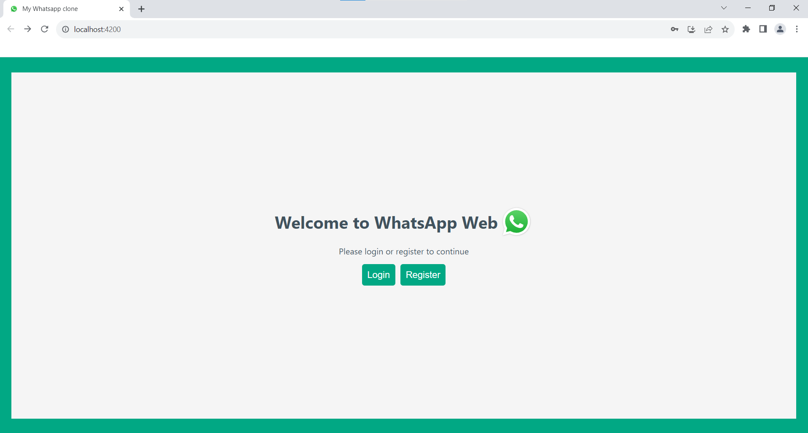
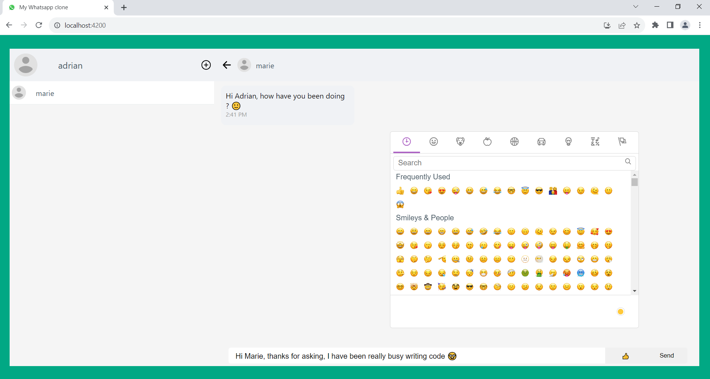
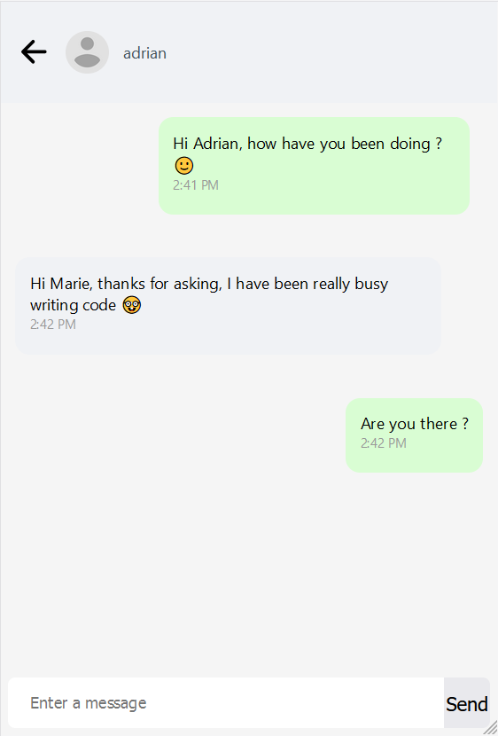
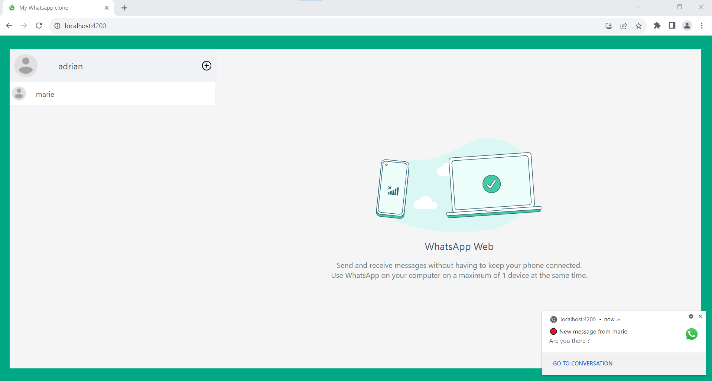
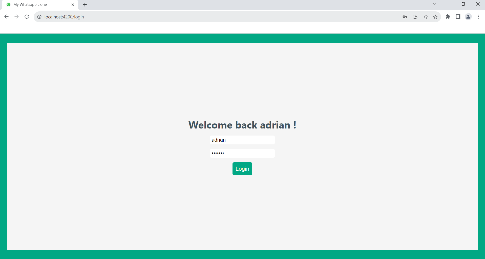

# WhatsApp Clone Frontend
This project was made to learn Angular 16 and Spring boot 3. The goal was to create a app similar to WhatsApp Web. The app is responsive.

## Functionality
* Real time messaging (using websockets)
* Delayed messaging, for example when a user sends a message to another offline user (using HTTP requests)
* Receiving web push in browser notifications when receiving messages while the app is not opened
* Adding friends
## Preview
### Chatting with a user

### Chatting on mobile with a user

### Receiving a push notification
Note : You also receive it when the page isn't opened. You can press the "Go to conversation" button to open the app in the right conversation. 

### Login page

## Set up development environment
* Install node v18.17.0 & npm 9.6.7
* Run `npm install`
* Put the URL of the API and the VAPID key of the API server in `envrionment.dev.ts` (for push notifications)

## Development server

Run `ng serve` for a dev server. Navigate to `http://localhost:4200/`. The application will automatically reload if you change any of the source files.

## Code scaffolding

Run `ng generate component component-name` to generate a new component. You can also use `ng generate directive|pipe|service|class|guard|interface|enum|module`.

## Build

Run `ng build` to build the project. The build artifacts will be stored in the `dist/` directory.

## Running unit tests

Run `ng test` to execute the unit tests via [Karma](https://karma-runner.github.io).

## Running end-to-end tests

Run `ng e2e` to execute the end-to-end tests via a platform of your choice. To use this command, you need to first add a package that implements end-to-end testing capabilities.